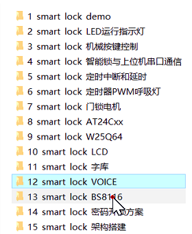
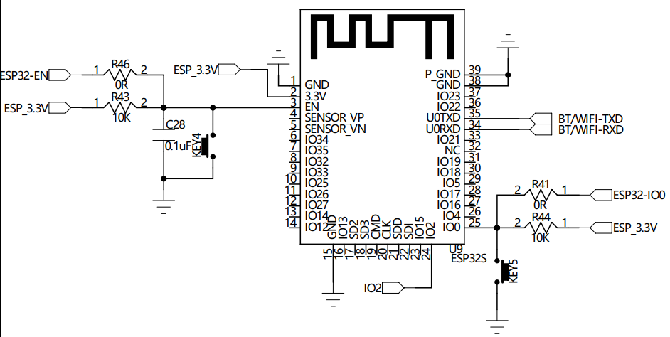
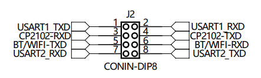

# 智能锁项目笔记

## 项目怎么做的？



### 项目流程

1. 需求分析
   1. 先对各模块进行了学习
2. 搭建架构
3. 写底层驱动和应用功能
4. 将驱动代码和应用功能添加到架构中
5. 测试
6. 优化

### 架构搭建

1. 初始化部分
2. 中断控制部分
3. 主逻辑（**状态机扫描各页面的状态**）

### 开发方式

- 寄存器开发方式
- 标准外设库函数开发
  - 学会标准库的使用方法
- HAL库开发
  - 可以结合cubeX快速生成初始化代码
- AI辅助写（**注意小BUG，需要审查**）

### 电机驱动芯片

- 放大电路（放大IO口的电路）

- H桥电路（控制正反转动）

### LCD屏幕的使用过程

- 初始化部分程序（必要的初始化和配置）
- 显示部分程序（业务逻辑）
- 其他屏幕设计可以参考LCD屏幕的使用方法

### 字库

- 什么是字库
- 如何制作字库
- 如何烧录字库
  - 操作
  - 代码
  - 优化
- 如何使用字库

### 语音播报模块

载波控制（**设备自定义时序通信**）

### 电容触摸按键

- 看说明书设计程序
- 写出按键扫描
- 电容触摸板/屏幕

### 密码开锁方案

- 数组和屏幕
- AT存储

### 架构搭建

状态扫描方式（**所有页面都平行扫描**）

## 前置

### **嵌入式项目中，逐个功能实现和搭建框架后再逐个功能实现的差别，不搭建框架的话，会时刻影响前面的代码，耦合度太高？**

**直接逐个功能实现的方式：**

1. 容易造成代码高度耦合。比如实现串口功能时直接写死了数据处理逻辑，后续添加其他功能时可能需要大量修改原有代码。
2. 代码复用性差。类似的功能可能会在不同地方重复编写，导致代码冗余且难以维护。
3. 扩展性受限。新增功能时经常需要修改现有代码，容易引入bug。

**先搭建框架再实现功能的方式：**

1. 通过良好的架构设计(如分层架构)，实现各模块解耦。比如：
   - 硬件抽象层(HAL)处理底层硬件
   - **驱动层处理具体外设**
   - **应用层实现业务逻辑**
2. 定义清晰的接口，使各模块之间通过标准接口通信，而不是直接调用。
3. 便于功能扩展和维护：
   - 新增功能时只需实现相应接口
   - 修改某个模块不会影响其他模块
   - 可以方便地复用已有模块

举个例子：假设要实现一个带显示功能的数据采集系统。

不使用框架的做法可能是：

```
void main() {
    while(1) {
        // 直接在一起写采集和显示逻辑
        data = adc_read();
        lcd_display(data);
    }
}
```

使用框架的做法：

```c
// 数据采集模块
typedef struct {
    void (*init)(void);
    uint16_t (*read)(void);
} Sensor_t;

// 显示模块
typedef struct {
    void (*init)(void);
    void (*display)(uint16_t);
} Display_t;

void main() {
    Sensor_t sensor;
    Display_t display;
    
    // 初始化各模块
    sensor.init();
    display.init();
    
    while(1) {
        uint16_t data = sensor.read();
        display.display(data);
    }
}
```

**经过搭建框架，可以实现分层结构？驱动层和应用层？两者的代码不一样吗？**

驱动层(Driver Layer):

1. 主要负责硬件的直接操作
2. 提供硬件的基础功能接口
3. 代码特点:

```c
// 驱动层示例 - UART驱动
typedef struct {
    void (*init)(uint32_t baudrate);
    void (*send_byte)(uint8_t data);
    uint8_t (*receive_byte)(void);
    void (*enable_rx_interrupt)(void);
} UART_Driver_t;

// 具体实现
void UART_Init(uint32_t baudrate) {
    // 配置GPIO引脚
    GPIO_InitTypeDef gpio_init;
    gpio_init.Mode = GPIO_MODE_AF_PP;
    HAL_GPIO_Init(...);
    
    // 配置UART寄存器
    USART1->BRR = SystemCoreClock/baudrate;
    USART1->CR1 |= USART_CR1_UE | USART_CR1_TE;
}
```

应用层(Application Layer):

1. 实现具体的业务逻辑
2. 调用驱动层提供的接口
3. 代码特点:

```c
// 应用层示例 - 温度监控应用
typedef struct {
    float temp_threshold;
    void (*process_temp)(float temp);
    void (*alarm_handler)(void);
} TempMonitor_t;

// 具体实现
void TempMonitor_Process(float temp) {
    // 使用驱动层的接口发送数据
    char buf[32];
    sprintf(buf, "Temperature: %.1f\r\n", temp);
    
    // 通过UART发送温度数据
    for(int i = 0; buf[i]; i++) {
        uart.send_byte(buf[i]);
    }
    
    // 业务逻辑处理
    if(temp > temp_threshold) {
        alarm_handler();
    }
}
```

主要区别:

1. 关注点不同
   - **驱动层关注如何操作硬件(寄存器配置等)**
   - **应用层关注业务流程(数据处理、控制逻辑等)**
2. 依赖关系
   - 驱动层依赖硬件抽象层(HAL)
   - 应用层依赖驱动层提供的接口
3. 可移植性
   - 驱动层与硬件平台紧密相关
   - 应用层相对独立，更容易移植

这样的分层设计有助于:

- 代码复用(不同产品可以复用相同的驱动)
- 便于测试(可以单独测试各层功能)
- 提高可维护性(修改某层代码不影响其他层)

### 现在嵌入式系统开发方式有三种，寄存器，标准库，hal库他们之间有什么区别？

寄存器级开发：

```c
// 直接操作寄存器的例子 - 配置GPIO
GPIOA->MODER |= (1 << 10);  // 设置PA5为输出模式
GPIOA->ODR |= (1 << 5);     // PA5输出高电平
```

特点：

- 直接操作硬件寄存器，**执行效率最高**
- **代码量小，程序空间占用少**
- 需要深入理解硬件架构和寄存器功能
- **可移植性差，不同芯片的寄存器定义不同**
- 开发周期长，**容易出错**

标准库开发：

```c
// 使用标准库的例子 - 配置GPIO
GPIO_InitTypeDef GPIO_InitStructure;
GPIO_InitStructure.GPIO_Pin = GPIO_Pin_5;
GPIO_InitStructure.GPIO_Mode = GPIO_Mode_OUT;
GPIO_Init(GPIOA, &GPIO_InitStructure);
GPIO_SetBits(GPIOA, GPIO_Pin_5);
```

特点：

- 对寄存器操作进行了封装
- 相比寄存器级开发更容易理解和使用
- **仍需要了解部分底层细节**
- **可移植性一般，同系列芯片可以复用**
- **执行效率好，代码量适中**

HAL库开发：

```c
// 使用HAL库的例子 - 配置GPIO
GPIO_InitTypeDef GPIO_InitStruct = {0};
GPIO_InitStruct.Pin = GPIO_PIN_5;
GPIO_InitStruct.Mode = GPIO_MODE_OUTPUT_PP;
GPIO_InitStruct.Pull = GPIO_NOPULL;
GPIO_InitStruct.Speed = GPIO_SPEED_FREQ_LOW;
HAL_GPIO_Init(GPIOA, &GPIO_InitStruct);
HAL_GPIO_WritePin(GPIOA, GPIO_PIN_5, GPIO_PIN_SET);
```

特点：

- 最高层次的抽象，**屏蔽了硬件细节**
- 代码可读性好，容易上手
- **可移植性最好，跨平台开发方便**
- 执行效率较低，代码量大
- **适合快速开发，不太注重性能的场合**

选择建议：

1. 性能要求高的项目（如高速数据采集）：选择寄存器级开发
2. 平衡开发效率和性能：选择标准库开发
3. 注重开发效率和可移植性：选择HAL库开发

实际应用中可以混合使用：

```c
// 混合使用的例子
void Init_Device(void) {
    // 普通GPIO用HAL库初始化
    HAL_GPIO_Init(GPIOA, &GPIO_InitStruct);
    
    // 高速处理的部分用寄存器直接操作
    GPIOB->BSRR = GPIO_PIN_5;
}
```

### 库函数的学习重点

- 程序实现思路很重要，其他都可以使用库函数实现。

- 如果不能理解库函数参数的含义，需要知道根据库函数溯源到对应的寄存器位，根据手册知道具体的含义。
- 比如常见的串口配置思路：   
  - 串口初始化： 
    - GPIO控制器配置 
    - 串口控制器配置 
    - 用于中断接收的NVIC配置
  - 串口控制器的DMA使能可以在对应DMA功能函数时单独开启，这样就不用修改原来的代码了。

## 更新字库后想通过软件复位重新加载字库

在 STM32F401（以及其他基于 Cortex-M 的 STM32 系列）中，软件复位一般是通过系统控制寄存器（SCB，System Control Block）实现的。SCB 寄存器是 Cortex-M 内核的一部分，而不是外设寄存器，因此在参考手册中找不到专门的复位寄存器。

你可以通过调用 CMSIS 提供的内核函数，或者直接操作 SCB 寄存器来实现复位。

### **使用 CMSIS 内核函数**

CMSIS 提供了标准化的函数，直接调用即可完成复位操作。这个函数是：

```c
#include "stm32f4xx.h"

void NVIC_SystemReset(void);
```

调用方式：

```c
int main(void) {
    // 初始化代码...

    // 执行软件复位
    NVIC_SystemReset();

    while (1) {
        // 不会执行到这里，因为系统已复位
    }
}
```

原理

`NVIC_SystemReset()` 函数底层操作 SCB 寄存器中的 `AIRCR`（Application Interrupt and Reset Control Register），设置复位位（`SYSRESETREQ` 位）来触发系统复位。

### 直接操作 SCB 寄存器（手册上没有，也不好配置）

如果不使用 CMSIS 函数，也可以直接手动配置 `SCB->AIRCR` 来实现复位。操作步骤如下：

```c
#include "stm32f4xx.h"

#define AIRCR_VECTKEY_MASK    ((uint32_t)0x05FA0000) // 写入密钥值

void software_reset(void) {
    SCB->AIRCR = AIRCR_VECTKEY_MASK | (1 << SCB_AIRCR_SYSRESETREQ_Pos);
    while (1); // 等待复位
}

int main(void) {
    // 初始化代码...

    // 执行软件复位
    software_reset();

    while (1) {
        // 不会执行到这里，因为系统已复位
    }
}
```

注意

1. `AIRCR_VECTKEY_MASK` 是一个写保护密钥，写入时必须使用 `0x5FA`，否则写入无效。
2. 设置 `SYSRESETREQ` 位 (`1 << SCB_AIRCR_SYSRESETREQ_Pos`) 即触发软件复位。
3. 复位后，所有外设和系统状态都会恢复为初始状态，类似于硬件复位。

------

总结

如果你使用的是官方的 STM32 HAL 库或标准库，直接调用 `NVIC_SystemReset()` 是最简单和推荐的方式。如果你想更底层地操作，可以直接配置 SCB 寄存器。两种方法效果完全相同。

## 中途修改看门狗的重载值

```c
void iwdg_init(void)
{
    //时钟源配置-开启低速时钟
    RCC->CSR |= (1U<<0);
    //等待时钟稳定
    while(!(RCC->CSR & (1U<<1)));
    //解除写保护
    IWDG->KR = 0x5555;
    //设置分频为128分频,根据具体情况确定时间，32 kHz 低速内部 RC (LSI RC)，该 RC 用于驱动独立看门狗
    //250次/s
    IWDG->PR = 5;     //直接赋值更清晰
    //重装载值设置为2500 (超时时间约10秒)
    IWDG->RLR = 2500;
    //重载到计数器,任何时候将关键字 0xAAAA 写到 IWWDG_KR 寄存器中， 
    //IWDG_RLR 的值就会被重载到计数器，从而避免产生看门狗复位。
    IWDG->KR = 0xAAAA;//此时写保护再次开启
    //启动看门狗
    IWDG->KR = 0xCCCC;
    
    printf("看门狗启动\r\n");
}


//独立喂狗程序
void iwdg_feed(void)
{
    IWDG->KR = 0xAAAA;
}


//若要更改重载值， IWDG_SR 中的 RVU 位必须为 0。
//RVU： 看门狗计数器重载值更新 (Watchdog counter reload value update)
//可通过硬件将该位置 1 以指示重载值正在更新。当在 VDD 电压域下完成重载值更新操作后
//（需要多达 5 个 RC 40 kHz 周期）毫秒级，会通过硬件将该位复位。
//重载值只有在 RVU 位为 0 时才可更新。直接修改重载值可能会失败，因为没有确认上一次更新是否完成
//IWDG_PR 和 IWDG_RLR 寄存器具有写访问保护。若要修改寄存器，必须首先对 IWDG_KR
//寄存器写入代码 0x5555。而写入其他值则会破坏该序列，从而使寄存器访问保护再次生效。
//这意味着重装载操作（即写入 0xAAAA）也会启动写保护功能。   
//解除写保护
IWDG->KR = 0x5555;
while(IWDG->SR & (1U<<1));    // 等待之前的重载值加载完成，避免新重载值被覆盖或者错乱
IWDG->RLR = 250;
IWDG->KR = 0xAAAA;
```

## 两种串口发送判断的标志的区别

标志位区别:

- `usart6_send_byte`: 使用 TC (Transmission Complete) 标志位
- `USART6_SendChar`: 使用 TXE (Transmit Data Register Empty) 标志位

检查时机:

- TC: 检查整个数据帧(包括起始位、数据位、停止位)是否完全发送完成
- TXE: 只检查发送数据寄存器是否为空,可以写入新数据

各自优势:

使用TC标志 (`usart6_send_byte`):

- 可靠性更高,确保数据完全发送
- 适合在以下场景使用:
  - UART关闭前的最后发送
  - 更改波特率前
  - 进入低功耗模式前
  - 对时序要求严格的场合

使用TXE标志 (`USART6_SendChar`):

- 发送效率更高,尤其是连续发送时
- 适合在以下场景使用:
  - 普通数据传输
  - 需要高速连续发送
  - 对实时性要求高的场合

在实际应用中,如无特殊要求,推荐使用TXE标志的方式,可以获得更好的传输效率。


## mg200的硬件BUG问题

- 设计低功耗模式时，不管有没有上电，都会不时触发mg200的串口6接收中断和空闲中断

### 导致的问题

注册指纹界面时会轮询指纹模块的状态，采集三次指纹后，需要向指纹模块发送注册指令，后面会解析指纹模块回送的操作响应数据包，这个时候如果不做处理，就会可能解析到指纹模块偷发过来的数据而不是真的操作响应数据包，那么在校验中就会因为解析失败，而无法完成注册

```c
 mg200_send_command(0x7f,ID);//指定ID注册
            //解析响应的数据包
            if(mg200_read_cmd(0x7f,&para,&resu) != 0)   //通信失败，返回非零值就是响应数据有错误
            {
                printf("通信失败导致注册失败！如需重新注册，请再次进入注册功能！\r\n");
                //上电后，三次采集中只要有错误，需要重新上电重第一次采集开始
                MG200_PWR_RESET();
                return 0xff;
            }
```

### 解决方案

告诉单片机什么时候接收的数据是有效的

- 因为时不时偷发数据，导致mg200_buff啥时候可能有数据，需要告诉单片机什么时候数据是有效的

```c
/***********************************************
*函数名    ：USART6_IRQHandler
*函数功能  ：接收来自指纹模块的数据
*函数参数  ：无
*函数返回值：无
*函数描述  ：接收指纹模块传递过来的8个字节
***********************************************/
void USART6_IRQHandler(void){
    //为什么串口6的中断一直被触发
    //printf("mg200的指纹模块进入中断函数");
    static u8 i = 0;

    //判断是接收完成中断信号触发
    if(USART_GetITStatus(USART6, USART_IT_RXNE)){
        printf("mg200的指纹模块中断函数,是接收中断触发的");
        //清除中断标志位
        USART_ClearITPendingBit(USART6, USART_IT_RXNE);
        //紧急事件(只接受不做处理),每次只能接收一个字节数据,数据包被处理了才再次接收，否则不接受
        mg200_buff[i++] = USART_ReceiveData(USART6);
    }

    //连续的数据接收完了，判断是空闲中断
    if(USART_GetITStatus(USART6,USART_IT_IDLE))
    {
        //没上电他也发送数据
        //printf("mg200的指纹模块中断函数,是空闲中断触发的");
        //请中断标志位
        USART6->SR;
        USART6->DR;
        //紧急事件
        i = 0;       //下一次接收从0号开始放
        //低功耗模式，会一直偷发数据，需要给一个标志位来标志什么时候接收的数据的有效的指纹数据
        //上电好像会发数据啊，在发送命令给mg200时把mg200_rec_flag置为0
        mg200_rec_flag = 1;     //接收指令包完成，可以解析指令包
    }
}
```

- 在给mg200发送注册指令时，需要接收返回的数据包。
  - 在发送指令时，设置一个标志位的值为0
  - mg200会回送数据包

```c
/**
 * @brief mg200发送指令函数,mg要求的数据传输格式
 * 为了避免轮询，接收数据写在中断里
 */
void mg200_send_command(u8 command,u8 parameter){
    //发送7个字节数据给mg200
    u8 data[7] = {MG200_START_CODE, MG200_SEND_ADDR, MG200_RECV_ADDR, 0x00, 0x00, 0x00, 0x00};
    //指令码
    data[3] = command;
    //根据指令码的不同，可能的参数
    data[4] = parameter;
    //校验和
    u8 temp = (0x63 + 0x62 + command + parameter) & 0xff;
    data[6] = temp;
    USART6_SendBytes(data,7);
    //printf("7个字节数据发送成功\r\n");
    //防止上电会发送数据给MCU意外导致标志位提前置1（逆天bug）
    //低功耗模式会时不时偷发数据
	mg200_rec_flag = 0;//使其可以感应数据接收完成
}
```

- **从单片机发到单片机读太快了**

- 单片机发指令把标志位置0
- 单片机读取数据包时，应该等待一次接收把标志位置1后，才开始解析，不然解析到的时偷发的数据
  - **单片机发指令后，下一次一定是返回的数据包**
  - **单片机读数据包之前一定先发了指令，不用怕因为偷发置1而解析错误**

```c
/***********************************************
*函数名    ：mg200_read_cmd
*函数功能  ：解析中断中接收到的数据包
*函数参数  ：u8 cmd,u8 *parameter,u8 *result
*函数返回值：u8   返回值标志通信是否有问题
*函数描述  ：cmd 之前发送的指令  要接收到的应答码对应
             *parameter    接收到的命令参数
             *result       接收到命令执行的效果
说明一开始的担忧还是对的，数据包没有接收完成，判断逻辑已经执行完了。。。
***********************************************/
u8 mg200_read_cmd(u8 cmd,u8 *parameter,u8 *result)
{

	/*等待指令数据包在中断中接收完成*/
	while(!mg200_rec_flag);

    //这里清不清零无所谓，mg200偷发数据时会置1
    //单片机发送指令时会清一次零的，然后等待有效数据包接收后置1，跳出循环
	mg200_rec_flag = 0;               //标志位清零
	/*验证接收到的数据包*/
	if(mg200_buff[0] != 0x6c)   return 1;
	if(mg200_buff[1] != 0x62)   return 2;
	if(mg200_buff[2] != 0x63)   return 3;
	if(mg200_buff[3] != cmd)    return 4;
	
	*result = mg200_buff[4];               //获取到执行效果数据
	*parameter = mg200_buff[5];            //获取到返回的参数
	//if(mg200_rec_buff[6] != 0x00)   return 5;//预留位有时候会用到，不一定是0x00  获取版本号
	
	u8 check_sum = (0x62+0x63+cmd+*result+*parameter + mg200_buff[6]) & 0xff;
	if(mg200_buff[7] != check_sum) return 6;
	
	return 0;
}
```

## RFID射频识别

### **什么是RFID？**

**RFID**（Radio Frequency Identification，射频识别）是一种利用 **无线电波** 进行非接触式数据传输的技术，主要用于自动识别和跟踪目标对象（如物品、动物或人）。

- **核心功能**：**通过无线信号读取或写入附着在物体上的电子标签（Tag）中的数据。**
- **对比传统条形码**：**无需视线对准**、可批量读取、数据可更新、环境适应性强。

### **系统组成**

RFID系统主要由三部分构成：

1. **电子标签（Tag）**
   - 包含芯片（存储数据）和天线（收发信号）。
   - **类型**：
     - **无源标签**：依赖读写器发射的能量工作，无需电池，成本低，寿命长，但通信距离短（常见于门禁卡）。
     - **有源标签**：自带电池，主动发射信号，通信距离远（可达百米），但成本高、寿命有限（如车辆追踪）。
     - **半无源标签**：电池仅供电给芯片，通信仍依赖读写器能量。
2. **读写器（Reader）**
   - 通过天线发送射频信号，激活标签并读取/写入数据。
   - 可固定（如仓库入口）或手持（如物流扫描枪）。
3. **天线与软件系统**
   - 天线负责增强信号传输效率。
   - 软件系统处理数据，与数据库或物联网（IoT）平台集成。

### **工作原理**

1. 读写器通过天线发送特定频率的射频信号。
2. 标签进入磁场范围后，天线接收能量激活芯片（无源标签）或直接响应（有源标签）。
3. 标签将存储的数据（如ID、传感器信息）通过无线电波传回读写器。
4. 读写器解码数据并传输至后台系统处理。

### **主要技术参数**

- **频率范围**：
  - **低频（LF, 125-134 kHz）**：短距离（<10 cm），抗干扰强，适用于动物识别。
  - **高频（HF, 13.56 MHz）**：中等距离（~1 m），广泛用于支付卡、图书管理。
  - **超高频（UHF, 860-960 MHz）**：长距离（数米至数十米），适合物流和零售库存。
  - **微波（2.45 GHz及以上）**：更长距离，多用于特定工业场景。
- **通信协议**：ISO 14443（近场通信）、EPC Gen2（物流标准）等。

### **典型应用场景**

- **物流与供应链**：货物追踪、库存自动化管理。
- **零售**：无人收银（如Amazon Go）、防伪和防盗。
- **医疗**：患者身份识别、医疗器械追踪。
- **交通**：ETC自动收费、公交卡、共享单车锁。
- **工业**：设备维护记录、生产流程监控。
- **智慧城市**：垃圾分类管理、智能停车。

### 疑问1

**常用的门禁卡里面没有电池，是属于无源标签吗？ 超市里面的衣服商品上也有类似的标签，里面有线圈，没有电池，也是无源标签？ 汽车的电子钥匙是属于有源标签吗？**

**门禁卡（无源标签）**

- **原理**：
  门禁卡内部嵌入了 **无源RFID标签**（通常为 **高频HF，13.56 MHz**）。
  - 卡片没有电池，依靠读写器（如门禁感应器）发射的电磁场能量激活芯片，并通过线圈天线返回数据（如卡号）。
  - 通信距离短（通常<10 cm），符合门禁场景的安全需求。
- **典型应用**：
  公司门禁、校园一卡通、酒店房卡等。

------

**超市商品标签（无源标签或EAS标签）**

超市衣物上的标签可能分为两种技术：

**(1) 无源RFID标签**

- **结构**：包含芯片和线圈天线，无电池。
- **功能**：
  - 用于库存管理和自助结账（如优衣库、Zara的RFID标签）。
  - 读写器可批量读取商品信息，提升效率。
- **频率**：多为超高频UHF（860-960 MHz），读取距离可达数米。

**(2) EAS（电子商品防盗系统）标签**

- **结构**：仅有线圈或磁性材料，无芯片（严格来说不属于RFID）。
- **功能**：
  - 通过特定频率的电磁场触发警报（如未消磁时通过安检门会鸣响）。
  - **无法存储数据，仅用于防盗。**
- **注意**：若标签含芯片且可读写数据（如价格、尺码），则属于无源RFID标签。

------

**3. 汽车电子钥匙（混合技术）**

汽车钥匙的技术分为两类，需具体区分：

**(1) 传统遥控钥匙（有源标签）**

- **原理**：
  - 钥匙内置电池，按下按钮时主动发射无线电信号（频率通常为315 MHz或433 MHz）。
  - 属于 **有源标签**，通信距离较远（数十米）。
- **功能**：解锁/上锁车门、开启后备箱等。

**(2) 无钥匙进入系统（Passive Keyless Entry, PKE）**

- **原理**：
  - 钥匙内置 **无源RFID标签**（低频LF，125 kHz）和 **有源射频模块**。
  - **无源部分**：车辆发射低频信号唤醒钥匙，钥匙通过反向散射返回认证信号（无需电池供能）。
    - **实现车钥匙靠近就能解锁**
  - **有源部分**：钥匙主动发射UHF信号控制车门（需电池供电）。
    - **主动使用遥控解锁**
- **特点**：
  - 看似“无源”，实为混合设计，依赖电池维持部分功能。
  - 若钥匙电池耗尽，仍可通过物理接触（如将钥匙贴近车门）利用无源RFID功能应急解锁。

------

**总结对比**

| **场景**     | 标签类型      | 技术细节                                                     |
| :----------- | :------------ | :----------------------------------------------------------- |
| 门禁卡       | 无源RFID      | 依赖读写器供能，无电池，短距离通信。                         |
| 超市商品标签 | 无源RFID/EAS  | 无电池，RFID用于数据存储，EAS仅用于防盗。                    |
| 汽车电子钥匙 | 有源/混合设计 | 传统遥控钥匙为纯有源；无钥匙进入系统混合无源（认证）与有源（控制）技术。 |

------

**补充说明**

- **超市RFID标签的防盗设计**：
  部分RFID标签会结合EAS功能，既存储商品信息，又触发防盗警报（如Decathlon的标签）。
- **汽车钥匙的电池寿命**：
  无钥匙进入系统的钥匙电池通常可使用2-4年，电量不足时仪表盘会提示更换。

### 疑问2

**像超市的那种标签里面只有线圈的，只能起到防盗功能？没有消磁经过匝道时就会触发警报 RFID技术的TAG是可以被读取数据和被写入的？无源TAG里面的结构也只有线圈吗？**

**超市防盗标签（EAS）与RFID标签的区别**

**(1) EAS防盗标签（仅线圈，无芯片）**

- **结构与原理**：
  - 内部仅包含 **线圈或磁性材料**（如声磁标签中的铁氧体条），**没有芯片**，无法存储数据。
  - 通过线圈与防盗门（EAS天线）的电磁场共振触发警报（未消磁时）。
  - **功能单一**：仅用于防盗，无法记录商品信息或更新数据。
- **消磁与激活**：
  - 收银台通过强磁场或特定频率信号对标签消磁/解扣（如硬标签的机械解锁）。
  - 若未消磁，通过安检门时会因电磁场干扰触发警报。

**RFID标签（含芯片与天线）**

- **结构与原理**：
  - 包含 **芯片（存储数据）** 和 **天线（线圈或其他形式）**，无源标签依赖读写器供能。
  - **可读写数据**：支持通过读写器读取或修改芯片中的信息（如商品价格、批次号）。
- **功能扩展**：
  - 除防盗外，还可用于库存管理、自助结账、供应链追踪等。
  - 例如：优衣库的RFID标签同时支持防盗和库存统计。

**RFID标签的数据读写能力**

- **支持读写**：
  - **可读可写（Read/Write Tag）**：允许多次修改数据（如服装尺码、生产日期）。
  - **只读（Read-Only Tag）**：出厂时固化ID，不可更改（如低成本的商品标识）。
- **读写操作**：
  - 通过读写器发射的射频信号传递指令，芯片接收后执行数据擦写。
  - 例如：仓库中更新商品状态（“已出库”）。

**无源RFID标签的内部结构**

无源RFID标签并非“只有线圈”，其核心结构包括两部分：

**(1) 芯片（IC）**

- **功能**：
  - 存储数据（ID、传感器信息等）。
  - 处理读写器的指令（如加密认证、数据读写）。
- **能耗**：
  - 无源标签的芯片完全依赖读写器发射的电磁场能量驱动。

**(2) 天线**

- **形式**：
  - **低频/高频（LF/HF）标签**：通常采用 **线圈天线**（如门禁卡的环形线圈）。
  - **超高频（UHF）标签**：多使用 **偶极子天线**（长条形，适合远距离通信）。
- **作用**：
  - 接收读写器的能量并激活芯片。
  - 将芯片处理后的数据通过电磁波反向散射回读写器。

------

**4. 典型标签结构对比**

| **标签类型** | 芯片 | 天线形式       | 功能                     | 示例场景       |
| :----------- | :--- | :------------- | :----------------------- | :------------- |
| EAS防盗标签  | 无   | 线圈或磁性材料 | 仅触发防盗警报           | 超市未消磁商品 |
| 无源RFID标签 | 有   | 线圈/偶极子    | 数据存储、读写、防盗     | 优衣库商品标签 |
| 有源RFID标签 | 有   | 复杂天线       | 主动发射信号，远距离通信 | 物流集装箱追踪 |

------

**5. 补充说明**

**(1) RFID标签的防盗增强方案**

部分RFID标签会结合EAS功能：

- **双重模式标签**：
  - 平时作为RFID标签存储数据，若未结账则触发EAS防盗警报（如迪卡侬的标签）。
- **软件防盗**：
  - 结账时系统自动将RFID标签状态标记为“已售出”，未售出商品经过出口时触发警报。

**(2) 无源标签的微型化设计**

- 最新技术（如NFC标签）可将芯片和天线封装在超薄贴纸中（厚度<0.1mm），甚至嵌入纺织品。

------

**应用场景示例**

- **超市智能结账**：
  顾客将购物车推过RFID读写区，系统批量读取商品信息并自动结算（无需逐个扫描）。
- **服装品牌防伪**：
  通过加密的RFID标签验证商品真伪，消费者用手机NFC功能即可读取生产信息。

### 疑问3

**无源TAG标签好像可以使用读写器来读取其中的数据以及写入相关数据，但是手机的NFC功能好像具备赋值无源标签的功能，但是有一些加密的就不行，能说一下原理吗？**

你提到的现象涉及 **RFID/NFC 标签的数据读写机制**、**手机NFC的功能限制**以及 **加密技术的实现原理**。以下详细解释：

**无源标签的读写原理**

**(1) 基本读写流程**

- **读取数据**：
  读写器（或手机NFC）发射射频能量 → 标签天线接收能量激活芯片 → 芯片将存储的数据通过反向散射（Backscatter）传回读写器。
- **写入数据**：
  读写器发送特定指令和待写入数据 → 标签芯片接收后修改存储区内容（需芯片支持可写权限）。

**(2) 标签存储结构**

- **普通标签（如MIFARE Ultralight）**：
  存储区开放，无需密钥即可读写（类似“明文存储”）。
- **加密标签（如MIFARE Classic或DESFire）**：
  存储区分权限控制，需通过密钥认证才能访问特定区域。

**手机NFC的标签操作能力**

手机NFC本质是一个 **高频（13.56 MHz）RFID读写器**，支持以下操作：

**(1) 读取/写入非加密标签**

- **示例场景**：
  - 读取公交卡余额（公开数据区）。
  - 写入网址或文本到空白NFC标签（如智能海报）。
- **限制**：
  若标签存储区未加密，手机可直接读写（依赖APP权限，如NFC Tools）。

**(2) 无法破解加密标签**

- **加密标签的保护机制**：
  - **认证流程**：读写器需先与标签进行密钥交换（如3DES、AES算法），验证通过后才能访问数据。
  - **密钥存储**：密钥通常保存在芯片安全区，无法通过无线信号直接提取。
- **手机NFC的限制**：
  - 普通手机APP无法暴力破解加密算法（受计算能力和协议限制）。
  - 若不知密钥，即使复制标签的物理信号（如UID），也无法访问加密数据区。

**加密标签的典型技术**

**(1) 对称加密（如MIFARE Classic）**

- **原理**：
  读写器和标签使用相同的密钥进行认证（如MIFARE Classic的CRYPTO1算法）。
- **漏洞**：
  早期算法（如CRYPTO1）已被破解，可通过特殊设备（如Proxmark3）嗅探通信并推算密钥。
- **手机操作**：
  若已知密钥，可通过专业APP（如MIFARE Classic Tool）读写数据；否则无法复制完整数据。

**(2) 非对称加密（如MIFARE DESFire）**

- **原理**：
  使用公私钥对（如RSA、ECC），密钥不可逆向推导，安全性更高。
- **手机操作**：
  除非获得私钥授权，否则手机NFC无法读写加密数据区。

**(3) 物理防护**

- **防篡改设计**：
  部分标签（如银行卡）的芯片会检测物理破解尝试（如侧信道攻击），触发自毁机制。

**为什么有些标签可被手机“复制”？**

**(1) 仅复制UID（伪复制）**

- **UID（唯一标识符）**：
  部分标签的UID是明文且可模拟（如某些空白NFC标签）。
- **实际效果**：
  手机可模拟相同UID，但若系统校验加密数据或动态密钥，模拟标签仍无法通过验证。
  **示例**：
  - 小区门禁卡若仅校验UID，手机模拟后可开门；
  - 若门禁系统同时校验加密数据，则模拟无效。

**(2) 全数据克隆（需破解密钥）**

- **条件**：
  加密算法已被破解（如MIFARE Classic），且攻击者通过专业设备获取了密钥。
- **手机操作**：
  将密钥和加密数据写入可编程标签（如NTAG21x），但需依赖外部破解工具。

**实际案例对比**

| **标签类型**        | 是否可手机复制？ | 原理说明                                              |
| :------------------ | :--------------- | :---------------------------------------------------- |
| 未加密门禁卡        | ✅ 是             | 直接读取UID并模拟，无需密钥。                         |
| MIFARE Classic卡    | ⚠️ 部分           | 若已知密钥或算法被破解，可克隆；否则仅能模拟UID。     |
| 银行卡（PayWave）   | ❌ 否             | 使用动态密钥和EMV协议，每次交易生成新密文，无法复制。 |
| 加密工牌（DESFire） | ❌ 否             | 非对称加密+动态认证，手机无密钥无法克隆。             |

------

** 如何保护标签不被非法复制？**

- **选择高安全等级标签**：
  如MIFARE DESFire EV2、NXP NTAG 424 DNA，支持AES加密和防中继攻击（Anti-Relay）。
- **系统端增强校验**：
  不依赖UID，需验证加密数据或动态令牌（如一次一密）。
- **物理绑定**：
  标签与物体融合（如嵌入商品内部），破坏即失效。

------

**总结**

- **手机NFC可复制无源标签的条件**：
  标签未加密，或加密算法已被破解且密钥已知。
- **加密标签的安全性**：
  依赖算法强度、密钥管理及系统设计，普通用户无法通过手机NFC直接克隆。

### 疑问4

**总结来讲就是电子标签上也有天线比如线圈。外面的天线则用于增强读写器的信号的。 至于软件系统则是利用读写器进行读取标签数据和写入标签数据的，相当于实现业务价值**

**核心总结：RFID系统的核心组成与协作**

**1. 硬件部分**

1. **电子标签（Tag）**
   - **内部结构**：
     - **芯片（IC）**：存储数据（如唯一ID、状态信息）。
     - **天线（线圈/偶极子）**：接收读写器能量并传输数据（无源标签依赖此能量激活）。
     - **示例**：门禁卡中的线圈天线、UHF标签的偶极子天线。
   - **功能**：作为数据载体，被动或主动响应读写器信号。
2. **读写器（Reader）与外部天线**
   - **读写器**：
     - 控制射频信号的发射与接收，驱动标签通信。
     - 支持数据解析（如EPC编码）、防碰撞算法（多标签同时读取）。
   - **外部天线**：
     - 增强信号覆盖范围与稳定性（如扩大读取距离、适应复杂环境）。
     - 类型选择：圆极化天线（标签方向随机） vs. 线性极化天线（定向精准）。

------

**2. 软件系统**

软件系统是RFID的“大脑”，核心任务是将硬件采集的原始数据转化为业务价值：

1. **数据读写控制**：
   - 通过读写器向标签发送指令，完成数据读取或写入（如更新库存状态）。
   - 示例：仓库入口读写器扫描托盘标签，标记为“已入库”。
2. **业务逻辑实现**：
   - **基础逻辑**：
     - 门禁系统：验证标签权限→触发开门/报警。
     - 零售结算：读取商品标签→生成订单→扣减库存。
   - **高级功能**：
     - 数据分析：根据标签位置生成热力图（如商场客流分析）。
     - 自动化决策：库存低于阈值时自动触发补货流程。
3. **系统分层架构**：
   - **中间件**：
     - 数据过滤（去重、纠错）、协议转换（兼容不同读写器品牌）。
     - 示例：过滤无效标签信号，仅上传有效出入库记录。
   - **数据库**：
     - 存储静态数据（标签ID关联的商品信息）和动态事件（如物流轨迹）。
   - **应用层**：
     - 用户界面（如库存看板）、与外部系统集成（ERP、支付平台）。

------

**3. 协作流程示例：智能仓库管理**

1. **硬件交互**：
   - 托盘进入仓库时，固定读写器通过外部天线批量扫描标签，读取货物ID。
2. **软件处理**：
   - 中间件过滤重复数据，校验标签合法性（如黑名单检测）。
   - 应用系统更新库存数据库，触发自动化分拣任务。
3. **业务输出**：
   - 仓库管理员通过UI查看实时库存，系统自动生成补货工单。

------

**4. 关键补充**

- **标签天线的设计差异**：
  - 低频/高频标签多用线圈天线（短距离、高稳定性），超高频标签多用偶极子天线（长距离、低成本）。
- **外部天线的部署策略**：
  - 多天线阵列：覆盖仓库出入口的多个角度，避免读取盲区。
  - 功率调节：降低功率避免串读（如密集货架场景）。
- **软件安全设计**：
  - 数据加密：读写器与标签间采用AES加密，防止窃听。
  - 权限分级：限制不同角色对标签数据的访问权限（如仅允许管理员写入）。

------

**一句话总结**

**RFID系统通过标签天线与读写器天线完成能量与数据的无线交互，软件系统则在此基础之上，将原始信号转化为业务动作（如开门、结算、告警），驱动实际场景的自动化与智能化。**

### 射频卡属于RFID系统中的电子标签吗？

**射频卡（RF卡）属于RFID系统中的电子标签**，它是电子标签的一种具体应用形式。

**射频卡的本质**

射频卡（如门禁卡、公交卡、银行卡等）是一种**封装成卡片形态的电子标签**，其核心功能与RFID电子标签完全一致：

- **无源设计**：依赖读写器发射的电磁波获取能量（被动式标签）。
- **无线通信**：通过射频信号（如低频125kHz、高频13.56MHz、超高频等）与读写器交互。
- **数据存储**：芯片中存储ID、加密信息或其他数据。

------

**射频卡与电子标签的关系**

- **包含关系**：射频卡是电子标签的一种具体形态，而电子标签的形式更广泛（如贴纸、植入式标签、货物标签等）。
- **应用场景**：射频卡多用于短距离身份识别（如门禁、支付），而其他形态的标签可能用于物流、仓储、动物追踪等场景。

**区分其他概念**

- **接触式IC卡**（如SIM卡）：需物理接触读写，**不属于RFID**。
- **NFC技术**：基于高频RFID（13.56MHz），可视为RFID的子集，兼容部分射频卡。

###  S50射频卡（MIFARE Classic 1K）

每个扇区中的块3的**存取控制权限（Access Bits）**

控制块的 **Access Bits**（字节6～8）决定了数据块和控制块的操作权限。其通过 **3字节（24位）** 的二进制编码定义以下权限：

- **对数据块（块0～2）的权限**：读、写、加值、减值等。
- **对控制块（块3）的权限**：密码A/B的读取和修改权限。

**存取控制位规则**：

- 每个块（块0～3）对应 **3个控制位**（C1, C2, C3），共需 **12位**（3位×4块）。
- 剩余的 **12位**（3字节=24位）中，部分用于校验和兼容性（例如确保存取控制位的合法性）。
- **权限组合**通过二进制逻辑表定义，自己取查表

------

**操作类型**

对数据块和控制块的操作需通过 **密钥认证**（Key A或Key B）后方可执行：

1. **读（Read）**：读取块内容。
2. **写（Write）**：覆盖块数据。
3. **加值（Increment）**：仅对数值块有效，增加存储值。
4. **减值（Decrement）**：仅对数值块有效，减少存储值。
5. **传输（Transfer）**：将临时寄存器中的值写入块。
6. **中止（Halt）**：使卡片进入休眠状态。

------

**安全注意事项**

1. **默认密码风险**：出厂默认密码（如Key A=0xFFFFFFFFFFFF）需立即修改。
2. **权限配置错误**：错误的Access Bits可能导致扇区永久锁定。
3. **独立密钥管理**：每个扇区可设置独立密码（Key A/B），建议不同扇区使用不同密钥。
4. **数值块保护**：若数值块未配置正确权限，可能导致数据篡改。

------

**典型应用场景**

- **门禁系统**：UID用于身份识别，数据块存储用户权限。
  - **那扇门能进，那扇门不能进**
- **电子钱包**：数值块存储余额，通过加/减值操作扣费。
- **数据加密**：敏感信息存储在独立扇区，配合高强度密钥。

------

**总结**

S50卡的存储结构通过 **扇区-块** 的层级设计实现了灵活的数据管理与权限控制。实际应用中需重点关注：

1. **Access Bits的配置**，避免权限漏洞；
2. **密钥的安全存储**，防止未授权访问；
3. **数值块的特殊操作逻辑**，确保交易一致性。

### 读写数据都要先验证密码A和B吗？他们的作用是什么？

在 **MIFARE Classic 1K（S50）** 中，密码A（Key A）和密码B（Key B）的验证逻辑及作用完全由 **存取控制位（Access Bits）** 的配置决定。**并非所有操作都需要同时验证两个密码**

**密码A和密码B的核心作用**

| **密码类型** | **核心作用**                                                 |
| :----------- | :----------------------------------------------------------- |
| **Key A**    | - 默认用于认证扇区访问权限（出厂值通常为 `0xFFFFFFFFFFFF`） - 可修改，但需谨慎操作避免锁定扇区 |
| **Key B**    | - 可选密码，提供额外的权限分层（例如区分管理员与普通用户） - 可完全禁用（通过存取控制位配置） |

**是否需要同时验证两个密码？**

- **不需要同时验证**。每次操作仅需验证 **Key A** 或 **Key B** 中的一个，具体取决于 **存取控制位** 的配置。
- **例外情况**：若存取控制位设置为某些特殊组合（如 Key A 仅用于认证，Key B 被禁用），则只能使用 Key A。

**公开读 + 加密写（如公交卡余额扣费）**

- **配置**：存取控制位设为 `0 0 0`
- **操作逻辑**：
  - **读取余额**：无需密码（直接读数据块）。
  - **扣费（减值）**：需验证 Key B 才能执行操作。

**双密码分层管理（如企业门禁系统）**

- **配置**：存取控制位设为 `0 1 0`
- **操作逻辑**：
  - **普通员工**：使用 Key A 验证，仅能读取数据。
  - **管理员**：使用 Key B 验证，可修改权限或数据。

**完全锁定（防篡改场景）**

- **配置**：存取控制位设为 `1 1 1`
- **结果**：所有操作（包括读/写）均被禁止，扇区永久锁定（即使知道密码）。

## RC522读写器配置思路（使用别人现成的库吧，配置有一点多）

**我现在正在配置RC522读写器，我打算使用软件模拟SPI与它通信。 我已经配置好了SPI，但是不知道怎么配置RC522，没有大致的配置思路？ 我打算用来读写MIFARE Std 1k(MF1 IC S50): 国内常称：MF1  S50**

对于RC522配置，我建议按以下步骤进行：

初始化流程

- 先复位RC522芯片
  - 读和写寄存器函数要先写好

- 配置发送和接收的通信协议参数
- 设置中断和超时参数

关键寄存器配置

- Mode寄存器：设置通信类型（TypeA/TypeB）
- TxMode和RxMode寄存器：配置数据传输速率
- RFCfg寄存器：设置接收增益和载波检测阈值

MIFARE Std 1k卡片特定配置

- 设置CRC校验
- 配置编码方式为Miller编码
- 配置通信速率（106 kbps）

电源和天线配置

- 配置天线驱动
- 设置适当的发射功率
- 启动RF场

## LCD高刷

- 显示信息更快
- 程序整体运行流畅

1.在按键扫描的高速轮询中，避免同一界面屏幕反复显示一个背景图。

- 需要有带背景图片色的显示函数
- 否则就是每显示一个文字就重新显示整张背景图

2.选择相对快速的通信方式 SPI 

- 还是有从上到下的显示痕迹

3.选择FSMC控制器外扩SRAM，这不是通信，这相当于直接扩充SRAM的地址，需要32个IO口。

- 连接到屏幕的RAM也行，程序执行到对应的屏幕颜色值定义语句时，图片直接弹出来。也是需要32IO口。

4.还有一些芯片自带的LCD驱动接口LTDC控制器，比如F429等


## 如何快速使用一个外设

使用项目中的模块作为实例说明，在各点展开。

1. 准备资料
   1. 硬件测试板
   2. 相关例程
   3. 模块官方说明书
2. 如何看说明书
   1. 说明介绍
   2. 引脚
   3. 如何数据交互或者控制
3. 程序设计

## 驱动ESP32模块





**在一个现成的STM32F401的开发板项目上，我想了解项目是如何驱动ESP32的，因为ESP32似乎不能使用keil编程，而且好像也没有编程就可以驱动ESP32，需要事先下载AT固件的东西。ESP32在板子上除了必要的引脚，只引出了U0TXD,U0RXD他们分别对应的网络名为BT/WIFI-TXD,  BT/WIFI-RXD。**

从你描述的引脚情况来看，这个项目是通过 UART 串口通信来控制 ESP32 的。这是一个很常见的设计方案，具体工作原理如下：

ESP32 的预置配置

- ESP32 需要预先烧录 AT 固件。这个固件让 ESP32 能够响应 AT 指令
- AT 固件使 ESP32 变成一个可以通过串口控制的 WiFi/蓝牙模块
- 固件烧录通常使用乐鑫提供的工具完成，而不是用 Keil

通信流程

- STM32 通过 UART 发送 AT 指令控制 ESP32
- ESP32 执行指令并通过 UART 返回响应
- STM32 解析响应并进行相应处理


**我再跟你介绍一下我了解到的操作流程，首先利用跳线帽连接网络名为CP-T和BT/W-R  以及CP-R和BT/W-T。通过开发板上的USB接口，通过专门的工具下载AT固件。 你帮我分析一下这个过程**

跳线帽的连接配置是为了进行 ESP32 的固件烧录：

跳线连接分析：

- CP-T (可能是 CP210x 串口芯片的 TX) → BT/W-R (ESP32 的 RX)
- CP-R (可能是 CP210x 串口芯片的 RX) → BT/W-T (ESP32 的 TX)

这说明开发板上很可能集成了一个 CP210x 系列的 USB 转串口芯片，用于：

- 将 USB 通信转换为串口信号
- 使电脑能够直接通过 USB 与 ESP32 通信

烧录过程：

- USB 接口连接到电脑后，系统会识别出一个虚拟串口设备（由 CP210x 提供）
- 使用乐鑫的烧录工具（如 flash_download_tool）选择正确的串口
- 选择合适的 AT 固件进行下载

工作模式转换：

- 烧录完成后，需要移除这些跳线
- 改为 STM32 的 UART 与 ESP32 相连
- ESP32 就可以作为一个受 STM32 控制的 WiFi/蓝牙模块使用

这样的设计非常巧妙，因为：

- 使用同一组引脚既可以用于固件烧录，也可以用于正常工作
- 通过简单的跳线操作就能切换两种工作模式
- 不需要额外的编程接口，节省了成本和空间

**确实，后续固件烧录后，我看手册是将网络名为U1-R与CP-T连接，U1-T与CP-R连接。 BT/W-R与U2-T连接，BT/W-T与U2-R连接**

这个连接配置很有意思，让我分析一下：

第一组连接：

- U1-R 与 CP-T 连接
- U1-T 与 CP-R 连接

这组连接很可能是为了让 STM32 的 UART1 能够通过 CP210x 芯片与电脑通信，可以用于：

- 调试信息的输出
- 通过串口监视器观察系统运行状态
- 接收电脑发送的命令

第二组连接：

- BT/W-R 与 U2-T 连接（ESP32 的 RX 连接到 STM32 的 UART2 TX）
- BT/W-T 与 U2-R 连接（ESP32 的 TX 连接到 STM32 的 UART2 RX）

这组连接实现了：

- STM32 通过 UART2 与 ESP32 进行通信
- 可以发送 AT 指令控制 ESP32
- 接收 ESP32 返回的数据

这样的设计允许系统同时具备：

1. 调试通道（UART1 - CP210x - USB - 电脑）
2. WiFi/蓝牙控制通道（UART2 - ESP32）

这是一个很实用的配置，因为你可以一边通过串口监视器观察系统运行情况，一边测试 ESP32 的网络功能。

### 流程

**前期准备工作**

- 通过跳线帽连接 CP-T 与 BT/W-R、CP-R 与 BT/W-T
- 使用开发板的 USB 接口，配合乐鑫提供的烧录工具将 AT 固件下载到 ESP32
- AT 固件使 ESP32 能够通过串口接收和响应 AT 指令

**正常工作配置**

- 移除烧录用的跳线，改为以下连接：
  - U1-R 与 CP-T、U1-T 与 CP-R（调试通道）
  - BT/W-R 与 U2-T、BT/W-T 与 U2-R（ESP32 控制通道）

**工作流程**

- STM32 通过 UART2 向 ESP32 发送 AT 指令
- ESP32 执行指令并返回响应
- STM32 可以通过 UART1 输出调试信息到电脑
- 开发人员可以通过串口监视器实时观察系统运行状态

**这种设计的优点：**

- 无需直接编程 ESP32，只需预先烧录 AT 固件
- 通过简单的串口通信即可控制复杂的网络功能
- 保留独立的调试通道，便于开发和测试
- 通过跳线配置灵活切换工作模式

ESP32 AT 采用两个 UART 接口：UART0 用于下载固件和输出日志，UART1 用于发送 AT 命令和接收 AT 响应。默认情况下，UART0 和 UART1 均使用 `115200` 波特率进行通信。**但是应该修改了UART配置，UART0同时作为下载和AT命令，使用官方给的工具，生成了自定义的固件**。

你的 ESP32 AT 固件 **自定义了 UART 配置**，将 **UART0** 用于 **固件下载** 和 **AT 命令通信**，这意味着：

- **烧录固件时** 依然使用 UART0（默认波特率 115200）。
- **发送 AT 命令时** 也使用 UART0，而不是默认的 UART1。

### **注意事项（跟文档上按下EN复位操作一样）**

1. **串口冲突问题**
   - 由于 UART0 既用于烧录又用于 AT 命令，你需要 **在烧录完成后，复位 ESP32，确保进入 AT 模式，而不是 Boot 模式**。
   - 在某些情况下，可能需要 **手动拉高 EN（使能）引脚** 或 **重新上电** 让 ESP32 进入正常工作模式。
2. **AT 命令调试**
   - 你可以使用 **串口调试工具**（如 `SecureCRT`、`Hercules`、`SSCOM` 或 `Arduino Serial Monitor`），波特率设置为 **115200**。
   - 发送 `AT`，如果返回 `OK`，说明 AT 固件工作正常。
   - **记得换行**
3. **如何确认 ESP32 进入 AT 模式？**
   - 烧录完毕后，复位 ESP32，然后发送 `AT+GMR`。
   - 如果返回类似 `AT version: ...` 说明 AT 固件正常运行。
4. AT 命令以新行 (CR-LF) 结束，所以串口工具应设置为“新行模式”。

### ESP32回送的数据格式

ESP32发送信息的格式是以`\r\n`结尾，可以通过串口助手的16进制数据得知。

但是别用这个作为判断，因为不止发送一个换行。。。

## STM32F401与ESP32通信

### 硬件设计

BT/WIFI_Rx------------USART2_TX-----------PA2

BT/WIFI_Tx------------USART2_RX-----------PA3

把之前的USB的CP模块的接线改到单片机的USART2，之后通过单片机发送指令与ESP32通信而不是通过串口助手发送。

### 程序设计

- 串口2的相关函数

```
串口2的初始化函数

发送字符串函数

中断服务函数（后续发给串口1，再发送给CP模块响应给串口助手？）
```

- ESP32的相关函数

```
发送命令并且判断命令执行是否成功,命令超时检测函数
	①解决接收大数据包的时候,多次触发空闲中断导致误判问题,
	即后期使用任何命令调用此函数不需要任何特殊处理
	②解决如果命令一直执行失败,可设定时间,超出时间就跳过此命令
退出透传模式函数
	从发送数据模式进入到设置WIFI的时候需要用此函数
恢复出厂设置函数
	在初始化模块时候,先恢复出场设置更好
ESP32初始化配置函数
	串口初始化配置
	WIFI参数配置
	TCP参数配置
WIFI连接函数
WIF关闭函数
TCP连接函数
	TCP连接(服务器地址,端口号)
	发送模式设置
```

### ESP32发送过来的数据分类

- 从ESP32主动发过来的数据
- 响应单片机AT指令的数据

### ESP32回送数据的格式

以/r/n结尾，也就是0D 0A结尾。

### ESP32 AT 指令的最大返回数据量

ESP32 AT 固件在串口（UART）传输数据时，**单次返回数据的最大长度通常是 2048 字节**。但具体返回数据大小取决于以下因素：

1. **固件默认限制**
   - AT 固件 **默认返回数据最大 2048 字节**（对于大多数指令）。
   - 超过 2048 字节的数据 **会被拆分成多个包发送**。
2. **具体 AT 指令的返回限制**
   - `AT+GMR`（查询固件版本）：< 100 字节
   - `AT+CWLAP`（Wi-Fi 扫描）：可能 **超过 1024 字节**，但一般 **不会超 2048**
   - `AT+CIPRECVDATA`（TCP/UDP 数据接收）：**默认最大 2048 字节**
   - `AT+HTTPGET`（HTTP 请求）：**最大 2048 字节，超出部分分段返回**
3. **如何突破 2048 字节的限制？**
   - 采用 **流控（RTS/CTS）**，避免数据溢出。
   - 使用 **多次读取的方式拼接数据**（例如 `AT+CIPRECVDATA` 可以多次读取）。
   - **修改 AT 固件源码**，扩展缓冲区大小（需自行编译 ESP32 AT 固件）。


### WIFI信息的注意事项

- 特殊字符需作转义处理，当前需要转义的字符有 `,`   、`" `  、 `\`。

  - `\\`：转义反斜杠。
  - `\,`：转义逗号，分隔参数的逗号无需转义。
  - `\"`：转义双引号，表示字符串参数的双引号无需转义。
  - `\<any>`：转义 `<any>` 字符，即只使用 `<any>` 字符，不使用反斜杠。

- 只有 AT **命令** 中的特殊字符需要转义，其它地方无需转义。例如，AT 命令口打印 `>` 等待输入数据时，该数据不需要转义。

- ```
  AT+CWJAP="comma\,backslash\\ssid","1234567890"
  AT+MQTTPUB=0,"topic","\"{\"sensor\":012}\"",1,0
  ```

示例

```
// 如果目标 AP 的 SSID 是 "abc"，密码是 "0123456789"，则命令是：
AT+CWJAP="abc","0123456789"

// 如果目标 AP 的 SSID 是 "ab\,c"，密码是 "0123456789"\"，则命令是：
AT+CWJAP="ab\\\,c","0123456789\"\\"

// 如果多个 AP 有相同的 SSID "abc"，可通过 BSSID 找到目标 AP：
AT+CWJAP="abc","0123456789","ca:d7:19:d8:a6:44"

// 如果 ESP-AT 要求通过 PMF 连接 AP，则命令是：
AT+CWJAP="abc","0123456789",,,,,,,3
```

### WiFi无法连接，初始化都能得到响应

好像不能连接5G频段，需要把手机调整为2.4G频段。

## ESP32 AT指令实现的MQTT

### 什么是MQTT

MQTT 全称是 Message Queuing Telemetry Transport，它是一种基于消息队列的轻量级应用层通信协议，实现了消息发布和订阅。**设备可以作为客户端的形式通过它来发布和接收消息，实现数据上报和实时控制。**

MQTT 是一种简单的消息传递协议，设计用于具有低带宽的受限设备。因此，它是物联网设备接入的完美解决方案。

### ThingsCloud 支持哪些设备？

ThingsCloud 平台提供了标准的 MQTT 接入协议，支持 MQTT v3.1/v.5，任何支持 MQTT 协议的设备都可以通过相应的 MQTT 客户端代码接入平台。

那么，设备要支持 MQTT，有哪些常见的方式呢？通常不外乎以下几种：

- 各种单片机或嵌入式系统，使用支持 MQTT 或 TCP 协议的 2G/3G/4G/5G 、 NBIoT 等**无线通信模组，通过 AT 指令、串口透传、SDK 等方式快速接入平台。**
- 本身支持 OpenCPU 的通信模组，例如：**ESP32**、Air724UG 等，通过模组固件二次开发实现接入平台。
- 无法直接连网的传感器、IO 控制器、PLC 等设备，通过支持 MQTT 的网关/DTU 接入平台。


### 基于 TCP 的 MQTT 连接（需要本地创建 MQTT 代理）（适用于数据量少）

**基于设备已连接 Wi-Fi 的前提。**

#### 📌 1. 配置与连接 MQTT 服务器

以下指令用于配置 MQTT 连接参数，并建立连接。

| **操作**                 | **AT 指令**                                                  |
| ------------------------ | ------------------------------------------------------------ |
| **设置 MQTT 客户端信息** | `AT+MQTTUSERCFG=0,1,"esp32_client","your_username","your_password",0,0,""` |
| **连接 MQTT 服务器**     | `AT+MQTTCONN=0,"your-mqtt-server.com",1883,1`                |

✅ **连接成功响应**：

```c
+MQTTCONNECTED:0,1,"your-mqtt-server.com","1883","",1
OK
```

#### **📌 2. 发送（上报）数据到物联网平台**

用 `AT+MQTTPUB` 指令发布数据到指定主题（Topic）。

| **操作**           | **AT 指令**                                         |
| ------------------ | --------------------------------------------------- |
| **发布字符串消息** | `AT+MQTTPUB=0,"sensor/data","ESP32 is online!",1,0` |

✅ **成功响应**：`OK`

#### **📌 3. 订阅主题（接收数据下发）**

用 `AT+MQTTSUB` 指令订阅某个主题，ESP32 订阅后会收到 MQTT 服务器推送的数据。

| **操作**           | **AT 指令**                       |
| ------------------ | --------------------------------- |
| **订阅 MQTT 主题** | `AT+MQTTSUB=0,"device/control",1` |

✅ **成功响应**：`OK`

当物联网平台发送数据到 `device/control` 主题时，ESP32 会自动收到数据：

```
+MQTTSUBRECV:0,"device/control",5,hello
```

表示收到了 `"hello"` 这个消息。

#### **📌 4. 断开 MQTT 连接**

如果要断开 MQTT 连接，可以使用：`AT+MQTTCLEAN=0`

✅ **成功响应**：`OK`

#### 封装成函数

```c
void MQTT_Connect() {
    Esp32_SendandReceive("AT+MQTTUSERCFG=0,1,\"\",\"your_username\",\"your_password\",0,0,\"\"", "OK", 2000);
    Esp32_SendandReceive("AT+MQTTCONN=0,\"your-mqtt-server.com\",1883,1", "+MQTTCONNECTED", 5000);
}

void MQTT_Subscribe(char *topic) {
    char cmd[100];
    sprintf(cmd, "AT+MQTTSUB=0,\"%s\",1", topic);
    Esp32_SendandReceive(cmd, "OK", 3000);
}

void MQTT_Publish(char *topic, char *message) {
    char cmd[100];
    sprintf(cmd, "AT+MQTTPUB=0,\"%s\",\"%s\",1,0", topic, message);
    Esp32_SendandReceive(cmd, "OK", 3000);
}

void MQTT_Disconnect() {
    Esp32_SendandReceive("AT+MQTTCLEAN=0", "OK", 2000);
}


MQTT_Connect();                      // 连接MQTT服务器
MQTT_Subscribe("device/control");     // 订阅主题
MQTT_Publish("sensor/data", "Hello"); // 发送数据
MQTT_Disconnect();                    // 断开MQTT连接

```


#### 测试流程

- **先连接 MQTT 服务器**

- **订阅主题 `device/control`**

- **在物联网平台发送消息到 `device/control`**

- **ESP32 会自动接收**

- **ESP32 上报数据到 `sensor/data`**

## 单位的区别

### 关键区别与换算

| 场景         | 单位   | 换算关系                        | 示例                             |
| :----------- | :----- | :------------------------------ | :------------------------------- |
| **存储容量** | 1 KB   | 1024 B（默认） / 1000 B（厂商） | 文件大小显示为 1KB ≈ 1024 B      |
| **传输速率** | 1 KB/s | 1000 B/s（常用）                | 下载速度 10KB/s = 10,000 B/s     |
|              | 1 Kbps | 1000 bits/s = 125 B/s           | 带宽 100Mbps = 12.5MB/s 实际速度 |

------

### 常见混淆与注意事项

1. **B vs. b**：
   - **大写 B = 字节**，**小写 b = 比特**，1 Byte = 8 bits。
   - 例如：100 Mbps（兆比特每秒）= 12.5 MB/s（兆字节每秒）。
2. **进制差异**：
   - 存储领域可能混用二进制（1024）和十进制（1000），需留意上下文。
   - 速率单位（如 KB/s、Mbps）通常用十进制（1000），除非明确标注 KiB/s。
3. **实际应用**：
   - 下载工具显示的“MB/s”通常指十进制（1MB/s = 1,000,000 B/s）。
   - 内存、SSD 性能测试可能用二进制单位（如 1GiB/s = 1024³ B/s）。

- **存储单位**：1 KB ≈ 1024 B（默认），但厂商可能用 1000 B。
- **速度单位**：
  - 字节速率（B/s）：1 KB/s = 1000 B/s（常用）。
  - 比特速率（b/s）：1 Kbps = 1000 b/s，需转换为字节需除以 8（如 1000 b/s = 125 B/s）。
- **始终注意单位大小写（B vs. b）和进制标注（KB vs. KiB）**！

## 定时中断与执行函数

在 STM32 的中断处理中，如果一个 1ms 进入一次的定时中断（例如 SysTick 或 TIM 定时器）在中断服务函数（ISR）中执行了秒级的函数，会出现以下情况：

1. **不会被下一次中断打断**（默认情况下）
   STM32 的中断是**不可抢占自身的**，即同一个中断源的下一次中断不会打断当前正在执行的中断服务函数（ISR）。所以如果 ISR 里有一个耗时秒级的函数，下一次 1ms 定时中断**不会**在 1ms 时刻执行，而是要等到当前 ISR 执行完才会进入。
2. **可能导致中断丢失或延迟**
   由于 ISR 执行时间远大于 1ms，后续的定时中断可能会被丢失（如果中断不可堆叠）或一直等待当前 ISR 结束后才被响应，这会导致系统无法按 1ms 的节奏执行预期任务。
3. **系统响应变慢，影响实时性**
   如果中断执行时间太长，主程序（main 主循环）可能会长时间得不到执行，甚至影响其他外设（比如 UART 接收、按键扫描等），导致系统变得不稳定。

## 待优化

- 卡片，指纹，只开门成功一次，直到抬起刷新一次状态
- 各初始化之间的关系，能不能调整一下，谁应该在前面。

### 非阻塞式自动关门

**我有一个SMT32项目，是智能门锁，我想在看门之后实现非阻塞式自动关门： 我的想法是在一个1ms进一次中断里，使用变量++的方式，在成功开门时，将变量赋值为0，在中断里判断值是否大于等于5000，满足条件就执行关门程序，效果能实现，但是变量一直累加，因为无符号整型的环形结构，导致关门操作每隔一段时间会执行一次，你有什么好的方案？**

**事件标志法**：

- 可以设置一个标志位（如开门事件标志），在开门时将其设为1，在定时器中断里判断标志位是否为1。如果标志位为1且已经过了预定的延时（比如5秒），则执行关门操作并重置标志位。

### 初始化的先后关系

**比如MQTT设置相关的前提是WIFI已经连接，给屏幕亮度显示画面的前提是WiFi和MQTT已经配置好了或者已经返回了值，无论操作是否成功，屏幕才会亮起来。因为可能没有WiFi和MQTT，也可以使用单机版。**

给标志位判断不好使，程序还是会往下走。给一个while(1),不断判断标志位，只有WiFi和MQTT执行过了返回了操作状态，把标志位置位后才使用break跳出while（1），while（1）还要给看门狗赋值，防止不断复位，我正常看门狗有十秒才触发，已经够了。不过保险起见还是要喂狗。

亮度在后面，还能比WiFi和MQTT先亮？？？

### 没有重复逻辑但是会重复发送AT指令

为什么没有重复的逻辑WiFi和MQTT在响应数据超时后能反复执行？因为我的看门狗触发了？？？

`<qos>`（Quality of Service，服务质量）是 MQTT 协议中用于控制消息传输可靠性的重要参数。它决定了 MQTT 消息在客户端和服务器之间传输时的可靠性级别。MQTT 提供了三种 QoS 级别：

**QoS 0（最多送达一次, At most once）**

- 发送方发送消息后，不管对方是否收到，不会进行重传。
- 可能会丢失消息，但不会重复。
- 适用于对可靠性要求不高的场景，比如日志上报、传感器数据上传等。

**QoS 1（至少送达一次, At least once）**

- 发送方会保证消息至少被对方收到一次，如果没有收到确认（PUBACK），会进行重传。
- 可能会导致消息重复，但不会丢失。
- 适用于需要确保消息到达但可以容忍重复的场景，比如通知类消息。

**QoS 2（仅送达一次, Exactly once）**

- 采用两阶段确认机制，确保消息仅被对方接收 **一次**，不会重复也不会丢失。
- 传输可靠性最高，但会增加网络通信和处理的开销。
- 适用于要求严格的应用，比如财务交易或关键控制指令等。

**默认值：0**

如果不指定 `<qos>`，默认使用 **QoS 0**，即“最多送达一次”。在大多数情况下，这种模式下 MQTT 传输效率最高，但不能保证消息一定送达。

在你的智能门锁项目中，MQTT 通信的 QoS 选择可能要考虑：

- **QoS 0**：用于状态上传，比如门锁状态变化日志，丢失数据影响不大。
- **QoS 1**：用于远程开锁指令，确保门锁至少收到一次指令，即便有网络波动。
- **QoS 2**（如果你的 MQTT 服务器支持）可以用于涉及支付、权限变更等关键指令，但一般不推荐，因其效率较低。

#### 总结

- **ESP32一旦接收到指令无论对错一定给你响应。如果没有收到可能是因为网络波动，可能会触发超时重传。当然很大程度上取决于你选择的QoS，没有QoS要看AT固件的设定了。**

- 没有WiFi的前提下，不要执行MQTT相关代码，不然一直超时重传，影响了整个系统的使用
  - 也不要上报关门数据，否则一直重复
  - 要是WiFi中途断了怎么办？
  - 有断开重连配置
    - **AT+CWRECONNCFG**
    - 如果一开始就是单机版，后面连接上了，还是通过内核函数软件复位吧。不然无法连接MQTT
  - 在定时中断中，连接WiFi的基础上周期性检查，断开就把标志位`wifi_connect_flag`置1，这样关门上报数据代码就不会执行
    - 如果WiFi状态正常的情况分为两种，没断过或者重连。没断过不用复位连接重新MQTT，之前断过就软件复位连接MQTT
  - 不太好解决，MQTT限流？？？有问题？？？？
    - 初始化时，不应该上报关门数据，因为可以当开门后再自动关门时上报
    - 不然老是复位的话，会被MQTT服务器限流，导致无法上报。

## 其他

### 时钟总线上的外设复位寄存器

在很多硬件设计中，**复位寄存器在触发复位之后，硬件会自动将其恢复为默认值 `0`**，因此无需手动再写一次 `0`（不复位）。这种设计简化了复位操作流程，同时避免了冗余的写操作。

#### 为什么库函数只需要“先写 `0` 再写 `1`”？

1. **触发复位后，硬件自动清零：**
   - 复位信号在触发后，硬件通常会自动将复位寄存器恢复为默认状态（`0`），以表明复位已经结束。
   - 这意味着写 `1` 触发复位时，无需手动再写 `0`，因为硬件本身会完成复位信号的清除。
2. **复位完成后，外设状态即退出复位：**
   - 复位寄存器的主要任务是产生一个复位信号，并不需要长时间保持复位状态。
   - 写 `1` 后复位触发，寄存器会自动清零，从而让外设退出复位，回到工作状态。
3. **硬件设计简化了用户操作：**
   - 如果每次复位都需要写 `1` -> 写 `0`，不仅增加了代码复杂性，还可能导致用户误操作（比如漏写 `0`）。
   - 自动清零的机制让复位逻辑对用户透明，降低了使用的复杂性。

#### 为什么还需要写 `0` 再写 `1`？

尽管复位寄存器自动清零，但**库函数仍然需要先写 `0` 再写 `1`，原因如下：**

1. **清除可能的遗留状态：**
   - 如果某次复位操作失败，或者某些原因导致复位位未被正确清零，直接写 `1` 可能会导致复位逻辑失效。
   - 通过显式先写 `0`，可以清除任何可能的残留复位状态。
2. **确保复位信号完整：**
   - 某些硬件逻辑需要完整的 `0` -> `1` 的上升沿来触发复位。如果不先写 `0`，可能导致复位逻辑无法正常触发。


### 库函数开发的注意事项

**事项1**

- 还是先有程序思路再写代码，因为有一些库函数也没有实现，就只能手动寄存器实现。
  - 比如`USART_ClearITPendingBit(USART1, USART_IT_IDLE);`清除不了，没有这样的参数。
  - 需要手动实现
- 配置时有时候会跨函数，比如串口，GPIO口，串口，NVIC等，没有思路容易乱。

**事项2**

- 串口通信时GPIO配置复用功能时，要在GPIO基本设置的前面，外设总线时钟使能的后面，否则会偷发一个数据

### 库函数的通用配置思路

#### **比如定时器的延迟函数**

```c
void tim5Delay_Ms(u16 ms)
{
    // 使能TIM5的时钟
    RCC_APB1PeriphClockCmd(RCC_APB1Periph_TIM5, ENABLE);
    
    // 禁用定时器以进行配置
    TIM_Cmd(TIM5, DISABLE);
    
    // 配置TIM6的预分频器和自动重载值
    TIM_TimeBaseInitTypeDef TIM_TimeBaseStructure = {0};
    //默认一个结构体配置
    TIM_TimeBaseStructInit(&TIM_TimeBaseStructure);
    
    //只需要配置需要的参数，其他就用默认的
    TIM_TimeBaseStructure.TIM_Prescaler = 8400 - 1;
    TIM_TimeBaseStructure.TIM_Period = ms * 10 - 1;
    // 选择向上计数模式
    TIM_TimeBaseStructure.TIM_CounterMode = TIM_CounterMode_Up;
    //这里面也会产生一个更新事件，不用再写一个更新事件。
    TIM_TimeBaseInit(TIM5, &TIM_TimeBaseStructure);
    
    
    // 清除更新标志位
    TIM_ClearFlag(TIM5, TIM_FLAG_Update);
    
    // 使能定时器
    TIM_Cmd(TIM5, ENABLE);
    
    // 等待更新事件完成
    while(!TIM_GetFlagStatus(TIM5, TIM_FLAG_Update));
    
    // 可选：清除更新标志位
    TIM_ClearFlag(TIM5, TIM_FLAG_Update);
    // 禁用定时器以进行配置，关闭定时器或者设置单次计数模式
    TIM_Cmd(TIM5, DISABLE);
}
```

**先整理好配置思路，按照思路调用对应函数即可。不相关参数，可以不赋值（结构体），也可以通过先默认初始化配置结构体，再根据需求修改特定参数的配置思路，可以使代码更简洁、易读，并减少配置错误的风险。这种方法适用于所有外设的配置，推荐在开发过程中广泛使用。**

#### 是否可以使用“|”一起配置？

建议都分开写避免错误，但是分开写时必须保证每配置一个都是被赋值到寄存器中的，不然会被覆盖。

```c
GPIO_InitStruct.GPIO_Pin = GPIO_Pin_5;
GPIO_InitStruct.GPIO_Pin = GPIO_Pin_6;
GPIO_InitStruct.GPIO_Pin = GPIO_Pin_7;
GPIO_Init(GPIOA, &GPIO_InitStruct); // 只配置Pin7
```


